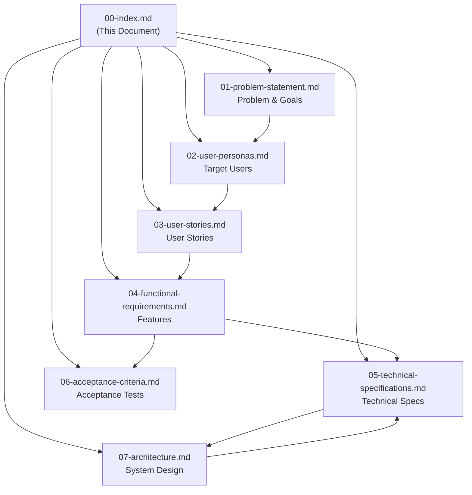

# cc-lib PRD Index

**Version**: 1.0.0
**Last Updated**: 2026-01-11
**Status**: Draft

## Overview

This is the Product Requirements Document (PRD) for cc-lib, a Claude Code plugin marketplace for development productivity agents.

## Document Structure



| Document | Description | Status | Related Docs |
|----------|-------------|--------|--------------|
| [01 - Problem Statement](./01-problem-statement.md) | Problems, opportunities, goals, and success metrics | Draft | → [User Personas](./02-user-personas.md) |
| [02 - User Personas](./02-user-personas.md) | Target user profiles and use cases | Draft | ← [Problem](./01-problem-statement.md) → [User Stories](./03-user-stories.md) |
| [03 - User Stories](./03-user-stories.md) | User stories organized by epics | Draft | ← [Personas](./02-user-personas.md) → [Functional Requirements](./04-functional-requirements.md) |
| [04 - Functional Requirements](./04-functional-requirements.md) | Detailed functional requirements | Draft | ← [User Stories](./03-user-stories.md) → [Technical Specs](./05-technical-specifications.md), [Acceptance Criteria](./06-acceptance-criteria.md) |
| [05 - Technical Specifications](./05-technical-specifications.md) | System architecture, data models, API specs | Draft | ← [Functional Requirements](./04-functional-requirements.md) ↔ [Architecture](./07-architecture.md) |
| [06 - Acceptance Criteria](./06-acceptance-criteria.md) | Given-When-Then acceptance criteria | Draft | ← [Functional Requirements](./04-functional-requirements.md) |
| [07 - Architecture](./07-architecture.md) | System architecture diagrams and design decisions | Draft | ← [Technical Specs](./05-technical-specifications.md) |

## Quick Navigation

### For Developers
- Start with [Technical Specifications](./05-technical-specifications.md)
- Review [Architecture](./07-architecture.md) for system design
- Check [Acceptance Criteria](./06-acceptance-criteria.md) for implementation verification

### For Product Managers
- Read [Problem Statement](./01-problem-statement.md) for context
- Review [User Personas](./02-user-personas.md) and [User Stories](./03-user-stories.md)
- Check [Success Metrics](./01-problem-statement.md#success-metrics)

### For QA/Testing
- Focus on [Acceptance Criteria](./06-acceptance-criteria.md)
- Review [Test Scenarios](./06-acceptance-criteria.md#test-scenarios)

## Key Concepts

### Terminology

| Term | Definition |
|------|------------|
| **Marketplace** | The GitHub-hosted plugin catalog for cc-lib |
| **Plugin** | A collection of agents, commands, and skills packaged together |
| **Agent** | A specialized AI agent defined in markdown with YAML frontmatter |
| **Category** | A grouping of agents by function (e.g., orchestration, code-review) |
| **Source Location** | `agents/{category}/` - Real agent files organized by category |
| **Plugin Location** | `plugins/{name}/agents/` - Symlinks to agents/ for plugin distribution |

### Directory Structure

```
cc-lib/
├── agents/              # Real source files (by category)
├── plugins/             # Plugin structure (symlinks to agents/)
├── installer/           # Build & installation tools
└── output/              # Build output (gitignored)
```

## Version History

| Version | Date | Changes |
|---------|------|---------|
| 1.0.0 | 2026-01-11 | Initial PRD creation |
| 1.1.0 | 2026-01-11 | Updated architecture with correct symlink direction |

## Contributing

When updating this PRD:
1. Update the version number in the modified document
2. Add an entry to the Version History table
3. Ensure all diagrams use Mermaid format for rendering
4. Maintain consistent terminology across all documents

## References

- [Claude Code Plugin Documentation](https://code.claude.com/docs/en/plugins)
- [Claude Code Settings](https://code.claude.com/docs/en/settings)
