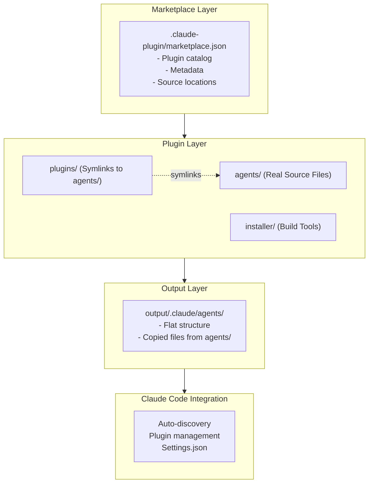

# Technical Specifications

**Version**: 1.1.0
**Last Updated**: 2026-01-11
**Status**: Draft

## Overview

cc-lib의 기술 사양을 정의합니다.

## System Architecture



## Directory Structure

```
cc-lib/
├── .claude-plugin/
│   └── marketplace.json             # Marketplace catalog
│
├── plugins/                         # Plugin structure (symlinks to agents/)
│   └── {plugin-name}/
│       ├── .claude-plugin/
│       │   └── plugin.json          # Plugin manifest
│       ├── agents/                  # Symlinks → ../../../agents/{category}/
│       ├── commands/                # Slash commands (.md)
│       ├── skills/                  # Skills (SKILL.md)
│       └── hooks/                   # Hooks configuration
│
├── agents/                          # Real agent source files (by category)
│   └── {category}/
│       └── *.md                     # Real files
│
├── installer/                       # Build & installation tools
│   ├── cli/
│   │   └── sync.sh                  # Build script (copies from agents/)
│   ├── sets/                        # Installation sets
│   ├── templates/                   # Settings templates
│   └── schemas/                     # JSON schemas
│
└── output/.claude/agents/           # Build output (gitignored, flat structure)
```

## Data Models

### marketplace.json Schema

```json
{
  "name": "string",                    // Required: Marketplace ID
  "owner": {
    "name": "string",                  // Required: Owner name
    "email": "string"                  // Optional: Contact
  },
  "metadata": {
    "description": "string",
    "version": "string",
    "pluginRoot": "string"             // Default: "./plugins"
  },
  "plugins": [
    {
      "name": "string",                // Required: Plugin ID
      "source": "string | object",      // Required: Location
      "description": "string",
      "version": "string",
      "author": { "name": "string" },
      "category": "string",
      "tags": ["string"],
      "license": "string",
      "repository": "string"
    }
  ]
}
```

### plugin.json Schema

```json
{
  "name": "string",                    // Required: Plugin ID (kebab-case)
  "version": "string",                 // Optional: Semver
  "description": "string",
  "author": {
    "name": "string"
  },
  "commands": "string | [string]",     // Optional: Custom paths
  "agents": "string | [string]"        // Optional: Custom paths
}
```

### Agent Definition Schema

```yaml
---
name: string                          # Required: Agent ID
description: string                   # Required: 50-1000 chars
model: string                         # Required: sonnet|haiku|opus

# Optional
version: string
color: string
tags: [string]
capabilities: [string]
parameters:
  max_parallel_tasks: number
  timeout_seconds: number
  temperature: number
  max_tokens: number
examples:
  - context: string
    input: string
    output: string
    explanation: string
---
```

## Build Process

### sync.sh Algorithm

```bash
#!/bin/bash
# sync.sh - Build agents/ to output/.claude/agents/

# 1. Setup
INPUT_DIR="agents/"
OUTPUT_DIR="output/.claude/agents/"
mkdir -p "$OUTPUT_DIR"

# 2. Process each .md file
find "$INPUT_DIR" -name "*.md" | while read file; do
    filename=$(basename "$file")

    # 3. Check if symlink
    if [ -L "$file" ]; then
        # Resolve symlink and copy target
        target=$(readlink -f "$file")
        cp "$target" "$OUTPUT_DIR/$filename"
    else
        # Copy regular file
        cp "$file" "$OUTPUT_DIR/$filename"
    fi
done
```

## API Specification

### Claude Code Plugin API

cc-lib는 Claude Code의 표준 플러그인 API를 따릅니다:

#### Marketplace Discovery

```bash
# Add marketplace
/plugin marketplace add <github-repo>

# Example
/plugin marketplace add k-park/cc-lib
```

#### Plugin Installation

```bash
# Install plugin
/plugin install <plugin>@<marketplace>

# Example
/plugin install orchestration@cc-lib
```

#### Plugin Management

```bash
# List installed plugins
/plugin list

# Remove plugin
/plugin remove <plugin>@<marketplace>

# Show plugin info
/plugin info <plugin>
```

### Settings.json Configuration

```json
{
  "extraKnownMarketplaces": {
    "cc-lib": {
      "source": {
        "source": "github",
        "repo": "k-park/cc-lib"
      }
    }
  },
  "enabledPlugins": {
    "orchestration@cc-lib": true
  }
}
```

## Technology Stack

| Component | Technology |
|-----------|------------|
| Plugin Format | Markdown + YAML frontmatter |
| Build Script | Bash |
| Schema Validation | JSON Schema |
| Version Control | Git |
| License | MIT |
| Documentation | Markdown |

## Security Considerations

| Aspect | Consideration |
|--------|---------------|
| Plugin Validation | JSON Schema validation |
| Code Execution | Plugins run in Claude Code sandbox |
| Data Privacy | No data sent to external servers |
| Access Control | User-controlled plugin enablement |
| Supply Chain | GitHub repository as source of truth |

## Performance Requirements

| Metric | Target |
|--------|--------|
| Plugin Install Time | < 30 seconds |
| Build Time | < 5 seconds |
| Marketplace Load Time | < 2 seconds |
| Plugin Discovery | < 1 second |

## Dependencies

| Dependency | Version | Purpose |
|------------|---------|---------|
| Claude Code | 2.1+ | Plugin system |
| Git | Any | Version control |
| Bash | 4.0+ | Build script |

## Compatibility

| Platform | Support |
|----------|---------|
| Linux | ✅ Native |
| macOS | ✅ Native |
| Windows | ✅ WSL/Git Bash |

## References

- [Claude Code Plugin Reference](https://code.claude.com/docs/en/plugins-reference)
- [Claude Code Settings](https://code.claude.com/docs/en/settings)
