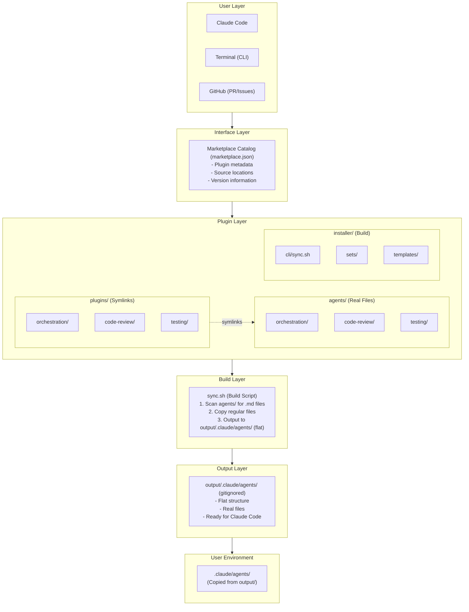
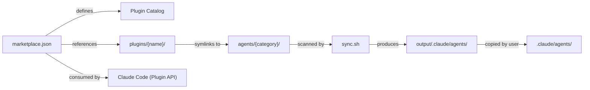
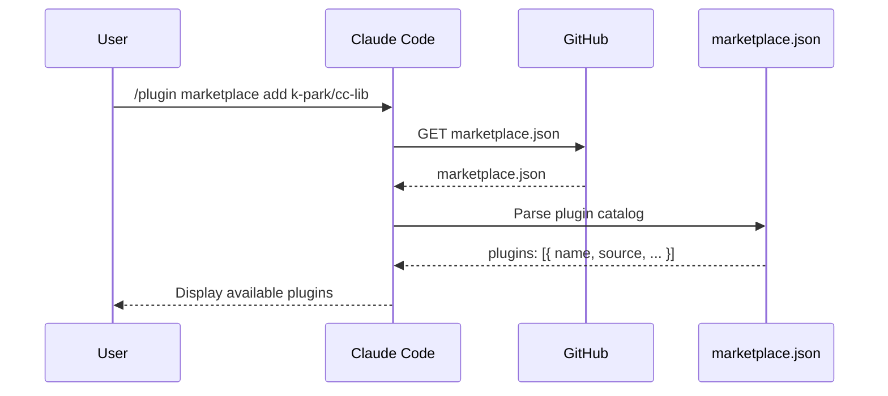
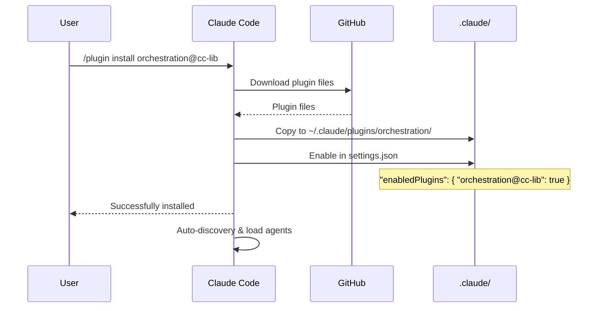
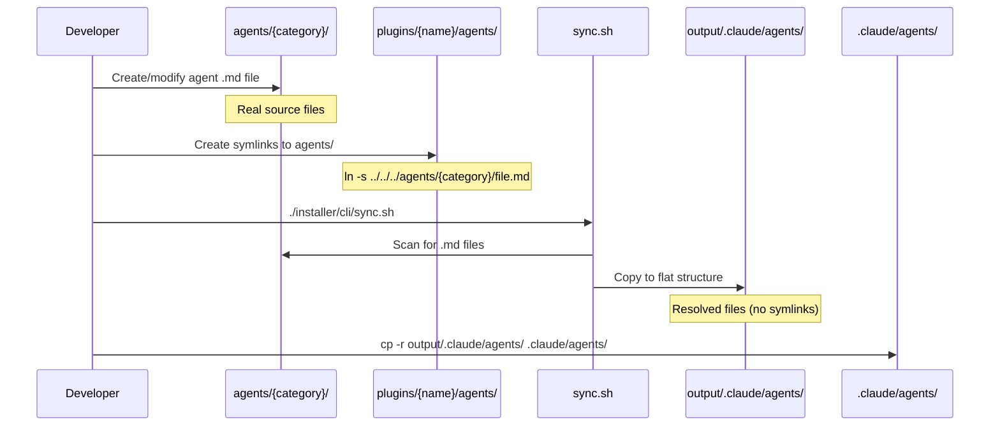
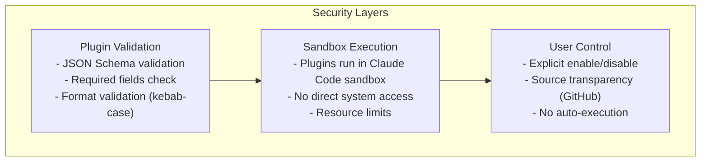

# Architecture

**Version**: 1.1.0
**Last Updated**: 2026-01-11
**Status**: Draft

## System Architecture Diagram



## Component Relationships



**Important**: `plugins/{name}/agents/` contains **symbolic links** to `agents/{category}/`. The `agents/` directory contains the **real source files**.

## Data Flow

### Plugin Discovery Flow



### Plugin Installation Flow



### Build Flow (Development)



## Directory Structure Detail

```
cc-lib/
│
├── .claude-plugin/                  # Marketplace root
│   └── marketplace.json            # Plugin catalog
│
├── plugins/                        # Plugin structure (symlinks to agents/)
│   └── orchestration/              # Plugin: orchestration
│       ├── .claude-plugin/
│       │   └── plugin.json         # Plugin manifest
│       └── agents/                 # Symbolic links to agents/
│           ├── task-orchestrator.md → ../../../agents/orchestration/task-orchestrator.md
│           └── parallel-task-orchestrator.md → ../../../agents/orchestration/parallel-task-orchestrator.md
│
├── agents/                         # Real agent source files (by category)
│   ├── orchestration/              # Real files
│   │   ├── task-orchestrator.md
│   │   └── parallel-task-orchestrator.md
│   ├── code-review/                # (future)
│   ├── testing/                    # (future)
│   └── ...
│
├── installer/                      # Build & installation tools
│   ├── cli/
│   │   └── sync.sh                # Build script
│   ├── sets/                      # Predefined installation sets
│   │   ├── mobile-basic.json
│   │   ├── developer.json
│   │   └── server-ci.json
│   ├── templates/                 # settings.json templates
│   └── schemas/                   # JSON schemas for validation
│
└── output/.claude/agents/          # Build output (flat, gitignored)
    ├── task-orchestrator.md       # Copied from agents/
    └── parallel-task-orchestrator.md
```

## Key Design Decisions

### Decision 1: Symbolic Links for Plugin Organization

**Problem**: 플러그인을 어떻게 조직할 것인가?

**Options**:
1. 플랫 구조: 모든 에이전트를 하나의 디렉토리에
2. 플러그인별 구조: plugins/ 아래에만 두기
3. **카테고리별 심볼릭 링크** (선택)

**Rationale**:
- `agents/` 에 실제 소스 파일 위치 (카테고리별 조직)
- `plugins/{name}/agents/` 에 심볼릭 링크로 참조
- 두 가지 관점 모두 지원:
  - 카테고리별 검색 (`agents/orchestration/`)
  - 플러그인별 배포 (`plugins/orchestration/`)

### Decision 2: Build Output in Separate Directory

**Problem**: 빌드 결과를 어디에 둘 것인가?

**Options**:
1. 제자리에 덮어쓰기
2. **output/ 디렉토리에 저장** (선택)
3. 사용자 홈 디렉토리에 저장

**Rationale**:
- Git 추적 방지 (gitignore)
- 원본 소스 보존
- 사용자가 선택적으로 복사

### Decision 3: GitHub as Marketplace

**Problem**: 마켓플레이스를 어떻게 호스팅할 것인가?

**Options**:
1. 전용 마켓플레이스 서버
2. **GitHub 저장소** (선택)
3. NPM 레지스트리

**Rationale**:
- 별도 인프라 불필요
- Git으로 버전 관리
- Claude Code가 기본 지원

## Technology Stack

| Layer | Technology |
|-------|------------|
| Marketplace | GitHub + JSON |
| Plugin Format | Markdown + YAML frontmatter |
| Build Script | Bash |
| Validation | JSON Schema |
| Distribution | Git |

## Security Architecture



## Scalability Considerations

| Aspect | Current Limit | Future Scale |
|--------|---------------|--------------|
| Plugins | 1 | 100+ |
| Agents per Plugin | 2 | 10+ |
| Marketplace Load | N/A | CDN |
| Concurrent Users | 1 | Team/Enterprise |

## References

- [Claude Code Plugin Architecture](https://code.claude.com/docs/en/plugins)
- [Microservices Architecture Patterns](https://martinfowler.com/articles/microservices.html)
